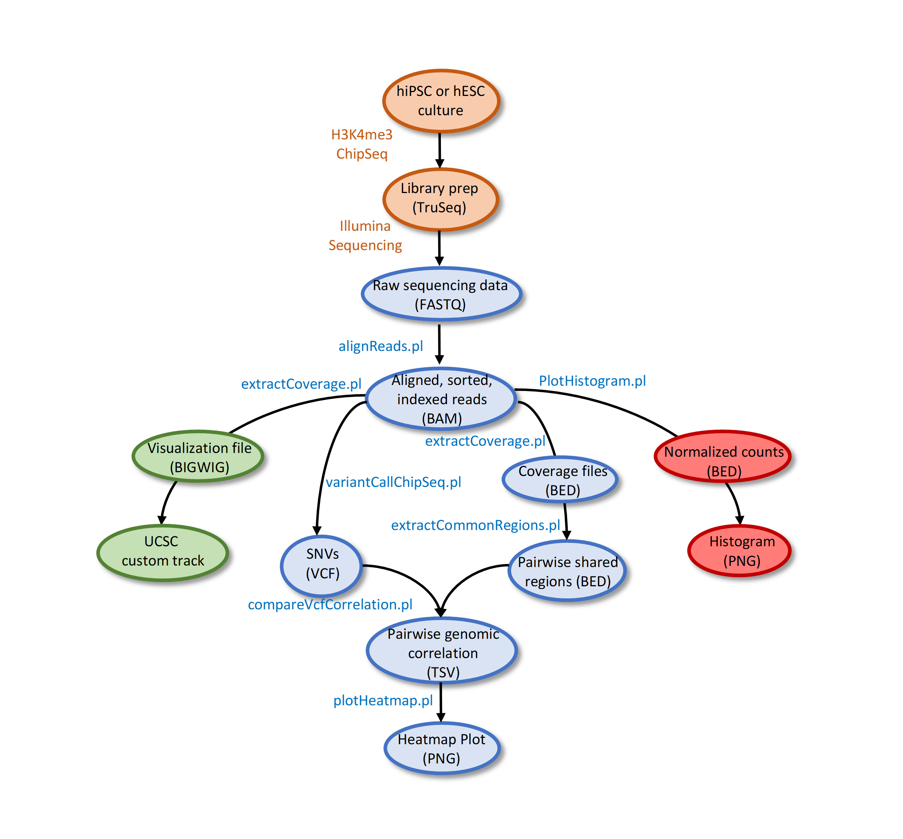
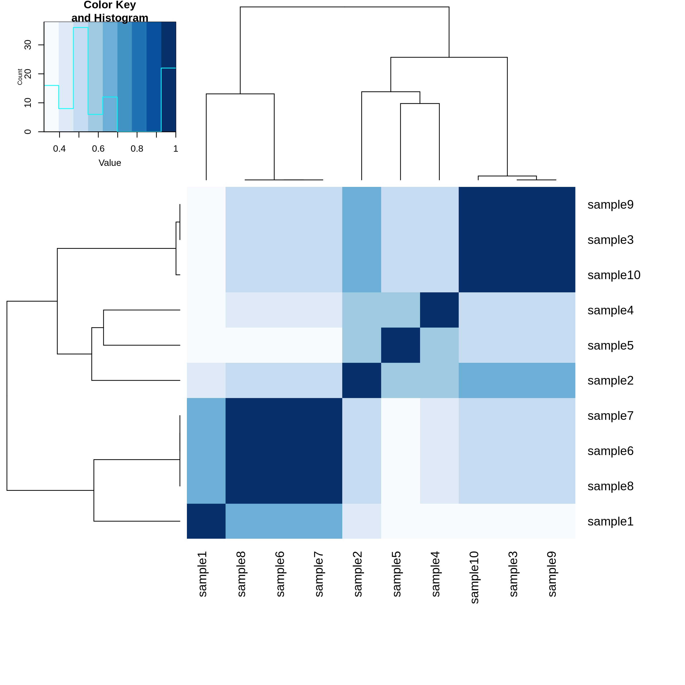

# CeLAuth
## Synopsis
 CeLAuth is a collection of Perl scripts that allow to authenticate cell lines from ChIP-seq experiments.

 ## Installation
 CeLAuth requires Perl, Java and R 

 #### Perl modules
* Parallel::ForkManager
* Sort::Key::Natural
* Statistics::Basic

To install perl modules: 
```
cpan Parallel::ForkManager Sort::Key::Natural Statistics::Basic
```

 #### R packages
* ggplot2
* gplots
* RColorBrewer
* gtools
* tidyr

To install R packages on an R session:
```
R
install.packages(c("ggplot2",“gplots”, “RColorBrewer”, "gtools", "tidyr"))
```

Then you can download and install the latest release:
```
 git clone --recursive https://github.com/bdolmo/CeLAuth.git
 ```
 ### About the pipline 
 The whole pipeline is written to be modular in design. This means that each step can be executed independently as long as the required input files are available 



 ### Step1.	FASTQ alignment
This can be achieved by executing the script `alignReads.pl`. This script makes use of an standard pipeline for mapping short reads based on BWA-MEM to generate aligned files (BAM), sorting and index creation through SAMtools and removal of PCR duplicates with Picard.

```
perl alignReads.pl -i <fastq_input_dir> -o <output_dir> -t <CPUs> -r  <reference_fasta>
```

Where:
```
-i,--input   STRING  Input directory with gzipped FASTQ files (fq.gz or fastq.gz)
-o,--outdir  STRING  Output directory where all BAM files will be generated
-g,--genome  STRING  Reference genome in FASTA format
-t,--threads INTEGER Number of CPUs to be used at mapping (default = 4)
```

BWA requires a genome index file located at the same directory as the reference genome. When executing alignReads.pl, if BWA index is absent, a prompt message will appear asking the user for its creation: 
```
Press ‘y’ to create a BWA index or press ‘n’ to cancel the operation
```
If accepted, a new genome index will be generated and then the FASTQ alignment will be resumed.

 ### Step2. SNV calling

Next to the mapping phase we will perform the variant calling for every BAM. We will use `variantCallChipSeq.pl` which wraps FreeBayes variant caller. FreeBayes is a popular tool that is commonly used to detect germline and somatic mutations in a wide variety of sequencing assays.

````
perl variantCallChipSeq.pl -i <bam_input_dir> -o <output_dir> -t <CPUs> -r <reference_fasta>
````

Where:
```
-i,--input   STRING  Input directory with BAM files
-o,--outdir  STRING  Output directory where all VCF files will be generated
-g,--genome  STRING  Reference genome in FASTA format
-t,--threads INTEGER Number of CPUs to be used at var calling (default = 4)
```

 ### Step3. Coverage extraction

In this phase we will extract all genomic segments that have a minimum coverage for each of the samples being analyzed. The coverage metric, refers to the total number of times a genomic position has been sequenced or the total number of reads that overlap that genomic position. In our preliminary analysis we observed that a minimum coverage of 3X was enough to get reliable results.
This script uses fast coverage extractions using [mosdepth](https://github.com/brentp/mosdepth) 

To extract the coverage:

```
perl extractCoverage.pl -i <bam_input_dir> -o <output_dir> -r <hg19_hg38> -n <normalization_factor> -m <minimum_coverage> -t <CPUs>
```

Where:
```
-i,--input      STRING   Input directory with BAM files
-o,--outdir     STRING   Output directory where all COVERAGE.bed files ending with *COVERAGE.bed will be generated
-r,--reference  STRING   Genome version (choose: hg19 or hg39, default = hg19)
-n,--normfactor INTEGER  Normalization factor (default = 10e7)
-m,--mincov     INTEGER  Minimum coverage required (default = 3)
-t,--threads    INTEGER  Number of CPUs to be used at coverage extraction (default = 4)
```

 ### Step4. Get normalized counts at protocadherin promoters and create per sample histograms

Now, we can plot a histogram of normalized counts at protocadherin promoters by using `plotHistogram.pl` as follows:

```
perl plotHistogram.pl -i <bam_input_dir> -o <output_dir> -r <hg19_hg38> -n <normalization_factor> -e <regions_bed>
```

Where:
```
-i,--input      STRING   Input directory with BAM files
-o,--outdir     STRING   Output directory
-r,--reference  STRING   Genome version (choose: hg19 or hg39, default = hg19)
-n,--normfactor INTEGER  Normalization factor (default = 10e7)
-e,--regions    STRING   BED regions to extract counts
```

 ### Step5. Identifying shared sequenced regions between samples

Instead of using all shared regions between the whole dataset, we preferred to compare each pairwise sample coverage profile to identify common regions. This comes at a cost of higher computational tasks, but offers the possibility to pool samples with greater differences at both sequencing characteristics or antibody class.

For this step we will use the script `extractCommonRegions.pl`:
```
perl extractCommonRegions.pl -i <coverage_dir> -t <CPUs> 
```

Where:
```
-i,--input   STRING   Input directory with files ending with *COVERAGE.bed 
-t,--threads INTEGER  Number of CPUs to be used (default = 4)
```
Output files ending with the suffix *shared.bed  will be released at the same input directory where all input files ending with *COVERAGE.bed were found.


 ### Step6. Creation of a genomic correlation matrix

The last analytical step consists on calculate the relatedness of every sample from their VCF files. Each pairwise is restricted over the shared sequenced regions identified previously. We will use SNVs exclusively, since INDEL lower genotyping robustness may introduce artifacts.

```
perl compareVcfCorrelation.pl -v <input_vcf_dir> -b <input_shared_bed_dir> -r <hg19_hg38> -o <output_dir> -t <CPUs>
```

Where:
```
-v,--vcf_dir STRING   Input directory with VCF files
-b,--bed_dir STRING   Input directory where with BED files ending with *shared.bed
-o,--outdir  INTEGER  Output directory
-r,--reference  STRING   Genome version (choose: hg19 or hg39, default = hg19)
-t,--threads INTEGER  Number of CPUs to be used (default = 4)
```
The output matrix is written on a Tab-Separated Values (TSV) file.

 ### Step7. Plotting

we have written a Perl script that takes as input the matrix in TSV format and produces a heatmap using gplots.
```
perl plotHeatmap.pl -i <INPUT_TSV> -o <OUTPUT_NAME> 
```

Where:
```
-i STRING   Input TSV file with sample genotype correlations
-o STRING   Output name of the resulting PNG image
```

Here we show and example plot from the test samples included in the project. We can observe that samples 3,9 and 10 can be clustered together, and also samples 6,7 and 8, whereas samples 1,2,4 and 5 can be classified as unrelated.


